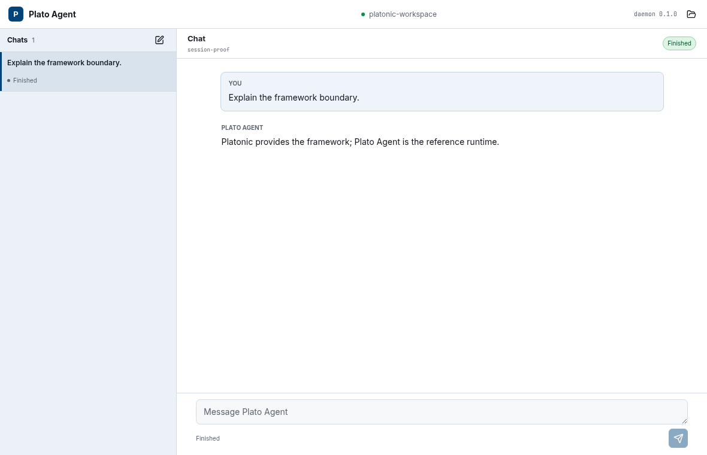

# Plato Agent

The reference agent runtime for the Platonic framework.

**Platonic**

*by Referential.ai*

Plato Agent is the named application built on the Platonic framework. It shows
its work: every step is recorded, replayable, and auditable.

The workspace [naming authority](https://github.com/referential-ai/platonic-workspace/blob/main/product/branding.md)
owns the hierarchy and exact forms.

**New here? Start with [docs/QUICKSTART.md](docs/QUICKSTART.md) — build, run, and test in five minutes.**

Existing crate, repository, library, command, config, state, and release
identities remain unchanged.

The bootstrap surface is intentionally small:

- `plato "question"` runs one bounded CLI invocation, streams live assistant text to stderr, and writes the run ledger to the platform user-state path.
- `plato -c "follow-up"` continues the latest workspace session from the SQLite ledger.
- `plato --events <file> "question"` writes an explicit JSONL ledger.
- `plato replay <file>` validates and prints a deterministic JSONL readback without network calls or tool execution.
- `plato replay [--run <id>]` replays the default SQLite ledger; omitted `--run` selects the latest session.
- `plato replay --db[=<path>] [--run <id>]` replays an explicit SQLite ledger.

## Configuration

Config resolution order:

1. `--config <path>`
2. `$PLATO_CONFIG`
3. `./plato.toml`
4. `~/.config/plato/config.toml` on Unix or `%APPDATA%\plato\config.toml` on Windows
5. built-in defaults

Auto-discovered `./plato.toml` cannot set `provider.api_key_env` or
`provider.base_url`. Use `--config`, `$PLATO_CONFIG`, or the user config for
provider credentials and custom endpoints.

Leading `~` expands in explicit config paths. Relative explicit paths resolve
against the workspace root. Built-in defaults use OpenRouter:

```toml
[provider]
kind = "open_router"
model = "~openai/gpt-latest"
api_key_env = "OPENROUTER_API_KEY"

[limits]
token_budget = 4000
max_output_tokens = 1024
max_turns = 8

[tools]
enabled = ["file.read", "file.list", "file.write", "file.edit", "shell.exec"]
```

OpenAI-compatible direct OpenAI config remains available:

```toml
[provider]
kind = "open_ai"
model = "gpt-5.5"
api_key_env = "OPENAI_API_KEY"
```

`file.read` and `file.list` are auto-allowed. `file.write`, `file.edit`, and
`shell.exec` require stdin approval and default to no. `shell.exec` runs from
the workspace root with a scrubbed child environment, no provider credentials,
bounded stdout/stderr, and a timeout. It uses `sh -c` on Unix and
`cmd.exe /C` on Windows; timeout or cancellation terminates the full process tree.
Use `--yolo` to auto-approve enabled workspace-write tools that would otherwise
prompt. Yolo mode does not enable disabled or unknown tools, approve network
tools, permit deny-class effects such as external side effects or secret access,
approve `shell.exec`, or bypass workspace path checks.

## SQLite Ledgers

- Bare `plato "..."` writes to the default platform user-state path.
- `plato -c "..."` continues the latest session from that store.
- `--db` also writes to the default platform user-state path.
- `--db=<path>` writes to that SQLite file; relative paths resolve against the current workspace.
- On Unix, default ledger directories are `0700` and the database and SQLite sidecars are `0600`; explicit `--db=<path>` permissions remain caller-managed.
- Use `=` for explicit paths because `--db` also has a bare default form.
- Live assistant text, `run_id`, `ledger_path`, and replay hints print to stderr. Stdout remains only the final answer.
- Replay shows final assistant messages, not partial streaming deltas.
- Ledger, approval, replay, and typed-transcript tool call ids are host-minted per run; provider ids remain provider-facing.
- Streamed runs request provider usage chunks; providers that omit usage still record zero usage.
- `plato replay` without arguments replays the latest session from the default platform SQLite ledger.
- `plato replay --run <id>` replays a single run.
- `--events <file>` is the explicit JSONL export/debug path.
- If the workspace daemon lock is held, SQLite CLI run/replay paths fail closed instead of competing with the daemon-owned store.

Replay forms:

```bash
cargo run --bin plato -- replay
cargo run --bin plato -- replay --db
cargo run --bin plato -- replay --db=/tmp/plato-agent.db
cargo run --bin plato -- replay --db=/tmp/plato-agent.db --run run_123
```

## Daemon

`plato-agentd` is the local runtime daemon for session-facing clients such as
the future `plato-tui`. The runtime topology and verb set are defined in
[`docs/ARCHITECTURE.md`](docs/ARCHITECTURE.md#runtime-topology) and issue
[#11](https://github.com/referential-ai/plato-agent/issues/11).

Start it for a workspace:

```bash
cargo run --bin plato-agentd -- --workspace "$PWD"
```

On startup it prints:

```text
workspace_id: <workspace-id>
socket_path: <daemon-endpoint>
ledger_path: <state-path>/agent.db
```

Default paths are keyed by the workspace id:

- Unix socket: `${XDG_RUNTIME_DIR:-<system-temp>/plato-agent-<uid>}/plato-agent/workspaces/<workspace-id>/agent.sock`
- Unix lock: `${XDG_RUNTIME_DIR:-<system-temp>/plato-agent-<uid>}/plato-agent/workspaces/<workspace-id>/agent.lock`
- Unix ledger: `${XDG_STATE_HOME:-$HOME/.local/state}/plato-agent/workspaces/<workspace-id>/agent.db`
- Windows pipe: `\\.\pipe\plato-agent-<workspace-id>`
- Windows lock and ledger: `%LOCALAPPDATA%\plato-agent\workspaces\<workspace-id>\agent.lock` and `agent.db`

Runtime directories are restricted to `0700` and the daemon socket to `0600`.
A custom Unix `--socket` parent is restricted to `0700` at startup. Windows
pipe and lock ACLs grant access only to the current user and reject remote pipe
clients. Windows clients limit server impersonation to identity inspection,
authenticate the server's user before sending protocol bytes, and bound
busy-pipe connection waits.

The daemon holds the lock while it is active. SIGINT and SIGTERM on Unix, and
Ctrl-C or Ctrl-Break on Windows, trigger a graceful shutdown: the daemon stops
accepting new connections, then removes its endpoint and lock before exiting.
On Windows the daemon keeps the exact lock file pinned until delete-on-close.
Do not remove a lock for a live daemon.
Live assistant deltas are transient `events.stream` events and are not written
to the ledger. After a `lagged` response, omitting `from_offset` resumes at the
current tip; `transcript.read` returns ledger-backed status and final answer.
`hello` advertises `transcript.read.typed`. Successful `transcript.read`
responses preserve the legacy `transcript` string and add ordered `typed.runs`
with structured chat, tool, policy, and approval entries.
`hello` also advertises `transcript.read.pending_approval`; while a run is
paused, its transcript response includes the complete pending approval and
omits it immediately after a decision or cancellation.
`hello` advertises `daemon.shutdown_if_idle` for graceful control. The request
omits `params` (an empty object is also accepted). It returns `refused_active`
without changing the daemon while a run or approval is active; otherwise it
closes run admission, returns `shutdown`, then exits and removes its socket and
lock. Duplicate shutdown and run-admission requests dispatched before teardown
fail with `daemon_shutting_down`; after the `shutdown` response, connection
close is expected and lock removal confirms success.

On Windows, installer control validates every current-user lock against its
workspace and live process image. Exact sidecars also require the expected pipe
server PID and `hello` response before control:

```powershell
plato-agentd control list-workspaces
plato-agentd control shutdown-if-idle --workspace C:\path\to\workspace
plato-agentd control shutdown-if-idle
```

The commands emit NDJSON. The aggregate shutdown validates the whole namespace
before sending any shutdown request, attempts every validated daemon, and exits
nonzero if a daemon is active or any lock cannot be validated. Locks are never
removed by the control client. A missing targeted daemon reports `not_running`;
a `shutdown` result is sent once and confirmed by process exit and lock removal.

Minimal NDJSON-over-Unix-socket check, using the `workspace_id` and
`socket_path` printed by the daemon:

```bash
WORKSPACE_ROOT="$PWD" \
WORKSPACE_ID="<workspace-id>" \
SOCKET_PATH="<socket-path>" \
python3 - <<'PY'
import json
import os
import socket

def send(file, request):
    file.write(json.dumps(request) + "\n")
    file.flush()
    print(file.readline(), end="")

with socket.socket(socket.AF_UNIX) as sock:
    sock.connect(os.environ["SOCKET_PATH"])
    file = sock.makefile("rw")
    send(file, {
        "v": 1,
        "id": "hello_1",
        "kind": "request",
        "method": "hello",
        "params": {
            "workspace_root": os.environ["WORKSPACE_ROOT"],
            "workspace_id": os.environ["WORKSPACE_ID"],
        },
    })
    send(file, {
        "v": 1,
        "id": "sessions_1",
        "kind": "request",
        "method": "sessions.list",
    })
PY
```

NDJSON `run.start` and `message.append` default to `wait: false`, returning a
`running` response immediately. Send `"wait": true` only when the connection can
block until the run finishes.

## Desktop (Development)

The desktop shell renders full typed session history, streams the selected run,
and supports new or continued messages, approval decisions, and cancel.
Provider credentials remain with the daemon. Linux development attaches to a
manually started daemon. On Windows, the shell first attaches to a valid daemon
for the selected workspace; when none is listening, it starts the absolute
sibling `plato-agentd.exe` sidecar and retries for a bounded interval.



```bash
# Terminal 1, from the repository root
cargo run --bin plato-agentd -- --workspace "$PWD"

# Terminal 2
cd desktop
npm ci
npm run tauri:dev
```

On first launch, choose the daemon workspace. The shell remembers its canonical
path as the next-launch seed and returns to the picker if that directory
disappears; each running shell keeps its own selected root. **New chat** clears
the selected session; otherwise the composer continues it. Switching chats does
not cancel their active runs. Closing the Windows shell never stops a daemon or
run. The ready shell checks daemon health without restarting it; a child crash
shows the disconnected screen, and only **Reconnect** attempts one new start.
The shell never removes a daemon lock, and reports the endpoint and lock paths
when startup remains blocked. Only one Windows shell may own a workspace at a
time. Linux development requires the
[Tauri system dependencies](https://v2.tauri.app/start/prerequisites/#linux).

### Windows Installer (Unsigned Development)

Phase A targets x64 Windows 10 22H2 or newer. Build the per-user NSIS installer
on Windows:

```powershell
cd desktop
npm ci
npm run tauri:bundle:windows
```

The installer retains its technical `Plato` identity under `%LOCALAPPDATA%`,
bundles the same-revision `plato-agentd.exe`, and downloads the WebView2
Evergreen bootstrapper when the runtime is absent. Upgrade and uninstall first
close the desktop, block new installed-sidecar starts, and make one bounded
aggregate `plato-agentd control shutdown-if-idle` invocation. An active daemon or
unvalidated lock aborts before installed binaries or user files change;
idle daemons exit and remove their locks. These unsigned artifacts are for
development proof only and are not distributed.

### Linux AppImage (Private Release)

Linux releases target x86-64 Ubuntu 24.04 on the WebKitGTK 4.1 ABI. The
AppImage contains the same-revision `plato-agentd` sidecar. It first attaches
to a valid workspace daemon; if none is available, it restores only the user's
login-shell `PATH`, starts the bundled sidecar, and retries for a bounded
interval. Closing Plato Agent detaches without stopping the daemon or active runs.
Startup failures report the sidecar, socket, and lock paths and never delete a
lock or fall back to a system daemon.

Authenticated private-release download and integrity check:

```bash
gh auth status
gh release download plato-desktop-v0.1.0 \
  --repo referential-ai/plato-agent \
  --pattern 'Plato-*-x86_64.AppImage*'
sha256sum --check Plato-*-x86_64.AppImage.sha256
chmod +x Plato-*-x86_64.AppImage
./Plato-*-x86_64.AppImage
```

Ubuntu 24.04 needs its WebKitGTK 4.1 runtime and `libfuse2t64`; Rust, Node,
and development packages are not runtime dependencies. These private artifacts
are not a public community launch. Build the AppImage on Ubuntu 24.04 with
`npm run tauri:bundle:linux -- --ci -- --locked` from `desktop/`.

## Discord Gateway

`plato-gateway-discord` receives Discord messages over an outbound WebSocket
and sends replies through Discord's REST API. Add the bot token variable name
and numeric owner user ids to `plato.toml`:

```toml
[gateway.discord]
api_key_env = "DISCORD_BOT_TOKEN"
owner_user_ids = [123456789]
```

With the workspace daemon already running, start the gateway in an environment
that contains the bot token but no provider credentials:

```bash
unset OPENAI_API_KEY OPENROUTER_API_KEY
export DISCORD_BOT_TOKEN="$(cat /path/to/discord-bot-token)"
cargo run --bin plato-gateway-discord -- --workspace "$PWD"
```

Enable the bot's Message Content intent. Grant View Channel, Send Messages, Add
Reactions, and Read Message History; also grant Send Messages in Threads when
using threads. Messages from other user ids are ignored. For allowed messages,
the gateway adds 👀, refreshes Discord's typing indicator while the run is
active, then replaces 👀 with ✅ or ❌. Canceled and interrupted runs remove 👀
without a terminal reaction. Each channel or DM continues one daemon session;
final answers are recovered from the ledger after daemon reconnects.
Approval-required runs post one bounded notification with the tool, effect, and
preview; grant or deny the request locally in `plato-tui`. The gateway never
sends approval decisions. Failed runs post
`Run failed. Inspect it locally with: plato replay`; canceled and interrupted
runs stay silent.

Allowed-owner messages over 4,096 UTF-8 bytes or matching the fixed unsafe-input
markers are rejected before daemon access with `Message rejected: unsafe or
oversized Discord input.` Accepted messages are forwarded unchanged.

## TUI

`plato --tui` is the interactive local entrypoint. It attaches to the workspace
daemon if one is running, or starts an embedded daemon for the TUI session.
It renders a chat-first transcript surface with an intro, live activity,
status rule, composer, session picker, and approval modal.

```bash
cargo run --bin plato -- --tui --config plato.toml
```

`plato-tui` remains a terminal client for a manually started `plato-agentd`. It
does not spawn, supervise, restart, or stop the daemon, and it does not call
providers, execute tools, or write SQLite directly.
Assistant text appears live through daemon `events.stream`; replay remains
based on final ledger messages.
Session picker statuses are `running`, `finished`, `failed`, `canceled`, or
`interrupted`; `interrupted` means a daemon restart closed a previously running
session so it can be resumed.
On attach, the TUI selects the latest session by default; submitted messages
continue that session until `/new` clears the selection.

```bash
cargo run --bin plato-agentd -- --workspace "$PWD"
cargo run --bin plato-tui -- --workspace "$PWD"
```

Use `--socket <path>` when connecting to a non-default socket, `--config <path>`
to pass a config file to daemon-started runs, and `--run <run_id>` to open a
specific transcript.

Keys:

- `Enter`: submit the composer to the daemon. A session can have only one
  active run.
- `/sessions`: open the session picker. `Enter` resumes the focused session;
  `Esc` closes the picker.
- `/new`: clear the selected session so the next submitted message starts fresh.
- `g` / `d`: grant or deny the focused approval request.
- `Ctrl-C`: request `run.cancel` for the active run; a second `Ctrl-C` exits the
  TUI. Exiting the TUI does not stop the daemon.
- `r`: reconnect and reload daemon state.
- `q` or `Esc`: exit the TUI.

## Commands

```bash
cargo run --bin plato -- "read README.md and summarize it"
cargo run --bin plato -- -c "what did you just summarize?"
cargo run --bin plato -- --yolo "write local-proof.txt with hello from Plato Agent"
cargo run --bin plato -- "run cargo test --locked and summarize the result"
cargo run --bin plato -- replay
cargo run --bin plato -- replay events.jsonl
cargo run --bin plato -- --db "read README.md and summarize it"
cargo run --bin plato -- --db=/tmp/plato-agent.db "read README.md and summarize it"
cargo run --bin plato -- replay --db
cargo run --bin plato -- replay --db=/tmp/plato-agent.db --run run_123
cargo run --bin plato -- --tui --config plato.toml
cargo run --bin plato-tui -- --workspace "$PWD"
```

## Dogfood Recipe

```bash
tmp=$(mktemp -d)
cat > "$tmp/plato.toml" <<'TOML'
[provider]
kind = "open_router"
model = "~openai/gpt-latest"
api_key_env = "OPENROUTER_API_KEY"
http_referer = "https://example.invalid"
app_title = "Plato Agent"

[limits]
token_budget = 4000
max_output_tokens = 512
max_turns = 8

[tools]
enabled = ["file.read", "file.list", "file.write", "file.edit"]
TOML

OPENROUTER_API_KEY="$(cat /path/to/your/openrouter-key)" \
  cargo run --bin plato -- --config "$tmp/plato.toml" --db="$tmp/agent.db" \
  "list the files in this workspace and summarize what you see"
```

## Boundary

`platonic-core` remains pure. Provider calls, local tools, approval prompts, ledger files, SQLite, daemon runtime, TUI, and connectors belong in this repo.

## License

Licensed under either of

- [Apache License, Version 2.0](LICENSE-APACHE) ([official text](https://www.apache.org/licenses/LICENSE-2.0))
- [MIT License](LICENSE-MIT) ([official text](https://opensource.org/licenses/MIT))

at your option.
